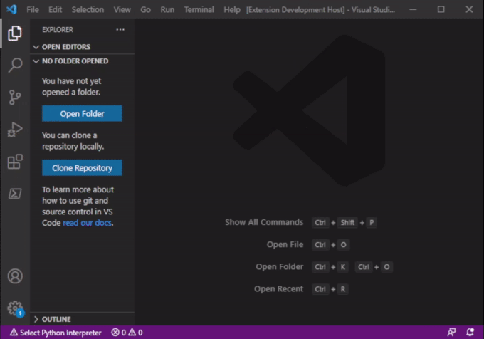

# Snippets for Ansible

I used long time the VSCode ansible extension which was retired at the end of
\2020. Missing the snippets I build them by myself based on the script of that
old extension and the new parser script of the atom autocomplete extension for
ansible.

* https://github.com/h-hirokawa/atom-autocomplete-ansible/blob/master/libs/parse_ansible.py
* https://github.com/VSChina/vscode-ansible

## Features

Provide snippets for most modules of ansible. Just press `Ctrl+SPACE` to get the
list of all snippets.

For example if you want to use `blockinfile` type *block* and press
`Ctrl+SPACE`, select the entry blockinfile_snippet and press `ENTER`.

> Tip: Using `TAB` you can jump to the defined placholder and select from fixed
> choices if available.

## Requirements

Document language need to be set to YAML.

## Known issues

If the snippets doesn't load after install, try to reload your VS Code.

## Release Notes

### 1.0.1

- Add keyword for easier search on markplaces
- Add licence to meta data

### 1.0.0

Initial public release of this extension. Snippets build for/with ansible v2.9.
